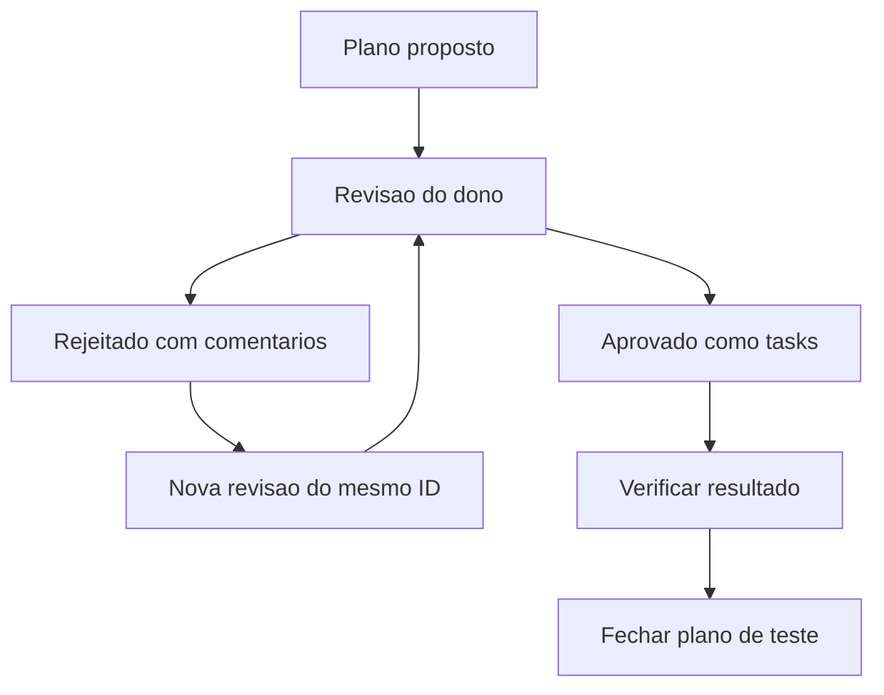

# Teste manual — fluxo de revisão

## Objetivo
Validar abertura, comentário persistente, rejeição, revisão com o mesmo ID, renderização Mermaid, aprovação e fechamento no DSH TUI.

## Escopo seguro
- Este é um artefato de teste separado dos planos existentes.
- Não editar código, instalar pacotes ou alterar outras tasks.
- Aprovar este plano autoriza somente as verificações descritas abaixo.

## Resultado esperado
Fluxo validado pelo dono, com evidências do harness e confirmação visual no TUI.

## Feedback incorporado nesta revisão
- Recebido o comentário “teste na linha 20”, associado ao critério de persistência do comentário na revisão anterior.
- Recebido o comentário da linha 23 pedindo um diagrama Mermaid; incluído abaixo.
- O harness confirmou a rejeição da revisão 1 sem autorização de execução. A persistência via Esc ainda depende da confirmação do dono.
- Os comentários da revisão 1 devem permanecer no histórico com suas âncoras originais, sem serem reassociados automaticamente a esta revisão.

## Diagrama para validação visual
O bloco abaixo deve aparecer como diagrama no renderizador nativo do TUI. Exibir apenas o código-fonte ou uma mensagem de fallback não confirma a renderização gráfica deste exemplo.

## Execução após aprovação
1. Ler este plano e confirmar a revisão aprovada e seu feedback.
2. Pedir ao dono a confirmação da navegação, persistência do rascunho após Esc, histórico dos comentários e renderização Mermaid.
3. Registrar as evidências e fechar somente este plano de teste quando o dono confirmar o resultado.

## Critérios de aceitação
- O comentário salvo sobrevive a Esc e à reabertura, sem ser enviado antes da rejeição.
- Rejeitar envia o comentário, mas não autoriza execução.
- A revisão mantém o ID, incrementa a revisão e precisa de nova aprovação.
- Os comentários antigos continuam vinculados à revisão e às linhas originais.
- O Mermaid acima é renderizado como diagrama legível no TUI.
- Aprovar como tasks autoriza apenas o escopo deste teste.
- O fechamento preserva conteúdo e histórico em .plan/closed/.
